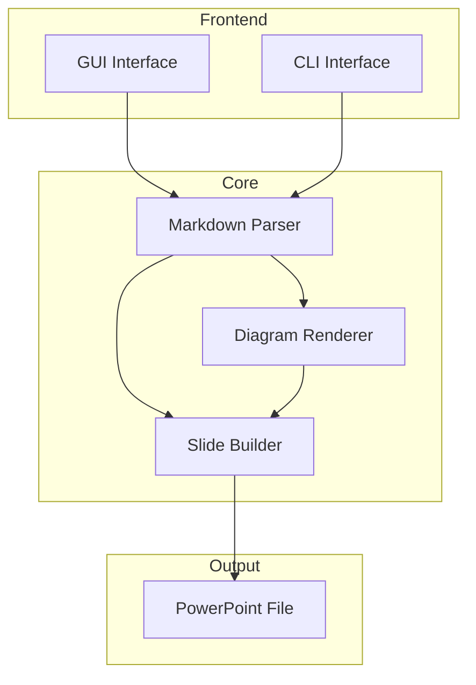

# md2pptx デモプレゼンテーション

これは md2pptx の機能を示すサンプル Markdown ファイルです。

## プロジェクト概要

### Markdown から PowerPoint への変換ツール

md2pptx は、Markdown ファイルから美しい PowerPoint プレゼンテーションを自動生成するツールです。

主な特徴：
- シンプルな Markdown 記法
- テンプレートサポート
- Mermaid 図表の自動レンダリング
- 表の自動変換

## サポートする要素

以下の Markdown 要素をサポートしています：

- **段落テキスト**
- *斜体* と **太字**
- `インラインコード`

### リスト

番号なしリスト：
- 項目 1
- 項目 2
  - サブ項目 2.1
  - サブ項目 2.2
- 項目 3

番号付きリスト：
1. ステップ 1
2. ステップ 2
3. ステップ 3

## コードブロック

```python
def convert_markdown_to_pptx(markdown_file, template=None):
    """Markdown を PowerPoint に変換する"""
    parser = MarkdownParser()
    slides = parser.parse(markdown_file)
    
    builder = SlideBuilder(template)
    builder.build(slides, "output.pptx")
    
    return "output.pptx"
```

## 表のサポート

| 機能 | 説明 | ステータス |
|------|------|------------|
| Markdown 解析 | AST ベースの解析 | ✅ 完了 |
| テンプレート | カスタムテンプレート対応 | ✅ 完了 |
| Mermaid | 図表の自動レンダリング | ✅ 完了 |
| GUI | 使いやすいインターフェース | ✅ 完了 |

## Mermaid 図表


## アーキテクチャ



## まとめ

md2pptx を使用することで：

1. **時間の節約** - Markdown で素早く内容を作成
2. **一貫性** - テンプレートによる統一されたデザイン
3. **再利用性** - Markdown ファイルの管理が簡単
4. **協業** - Git でのバージョン管理が可能

ご質問やフィードバックがありましたら、お気軽にお問い合わせください。